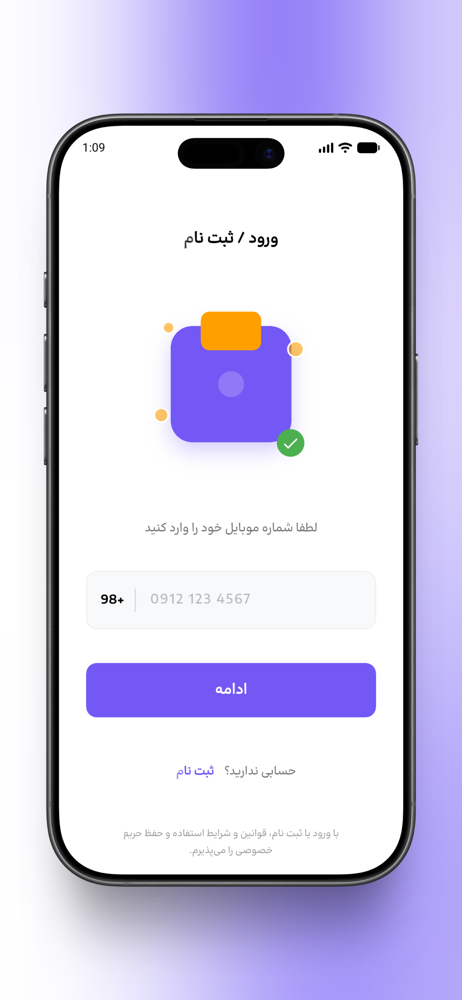
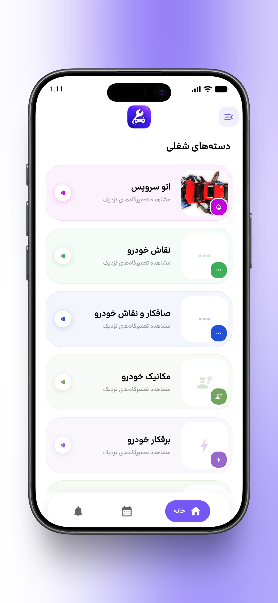
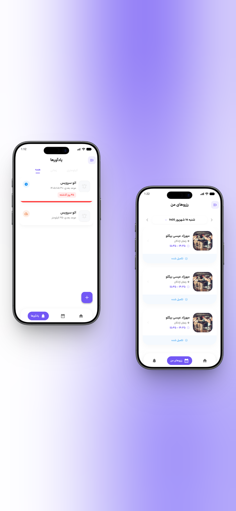
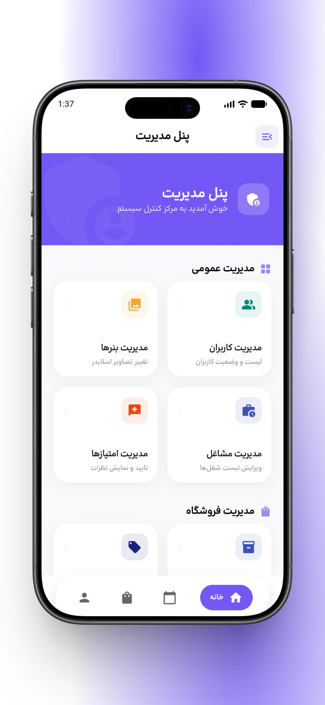
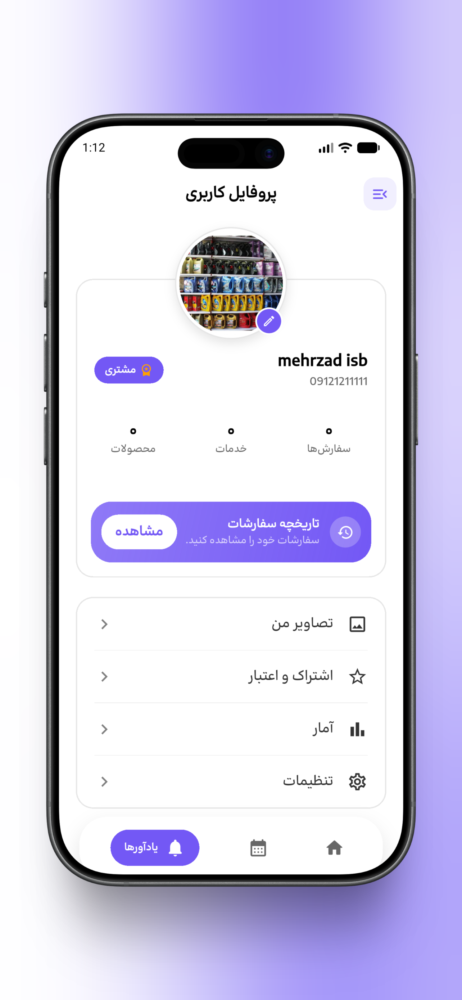

# 💼 CASE STUDY: Chaharmahal Shop Front — Enterprise Multi-Vendor E-Commerce & Service Platform


> **Case Study Overview**: A production-grade, multi-tenant digital commercial ecosystem engineered with Flutter. Combines E-Commerce retail, local repair shop directories, real-time appointment booking, maintenance reminders, and a comprehensive back-office ERP/CMS admin panel. Built with **Clean Architecture**, **SOLID Principles**, and **Feature-First** modularization.

---

## 📋 Case Study Snapshot

| Metric / Dimension | Project Details |
| :--- | :--- |
| **Role** | Lead Flutter Engineer & Solution Architect |
| **Domain** | E-Commerce, Local Services, Repair Shop Directory & Appointment Booking |
| **Target Audience** | Retail Customers, Service Technicians/Merchants, System Administrators |
| **Architecture** | Clean Architecture (Data, Domain, Presentation) + Feature-First Packaging |
| **State Management** | `flutter_bloc` + `bloc_concurrency` |
| **Platforms** | Android (APK / AAB), iOS, Web |

---

## ❓ 1. The Problem & Challenge Statement (مسئله‌ای که حل شد)

### Market & Technical Pain Points
1. **Commercial Fragmentation**: Consumers were forced to switch between multiple separate applications for purchasing physical products, discovering local repair technicians, booking service appointments, and tracking recurring service maintenance schedules.
2. **Merchant Operational Bottlenecks**: Local service providers and repair technicians lacked self-service digital tools to publish service pricing, showcase portfolios, and manage dynamic appointment availability time-slots.
3. **Architectural Complexity & Scale**: Building an application spanning 15+ complex sub-domains (Auth, Cart, Orders, Repair Shops, Appointments, Reminders, Admin CMS) without introducing technical debt, memory leaks, or unmaintainable UI-tangled code.
4. **Localization & UX Accessibility**: Need for native Persian (`fa_IR`) and English (`en_US`) RTL/LTR support, responsive layouts across mobile/tablet screen dimensions (`flutter_screenutil`), interactive map positioning, and custom Persian typography.

---

## 💡 2. The Solution & Core Value Delivered (راهکار ارائه شده)

**Chaharmahal Shop Front** resolves these challenges by providing a 3-in-1 unified digital marketplace:

```text
                               ┌────────────────────────────────────────┐
                               │       CHAHARMAHAL SHOP PLATFORM       │
                               └───────────────────┬────────────────────┘
                                                   │
         ┌─────────────────────────────────────────┼─────────────────────────────────────────┐
         ▼                                         ▼                                         ▼
┌─────────────────┐                       ┌─────────────────┐                       ┌─────────────────┐
│  Consumer App   │                       │ Merchant Portal │                       │ Admin Panel CMS │
│ Store & Booking │                       │ Catalog & Slots │                       │ Users & Settings│
└─────────────────┘                       └─────────────────┘                       └─────────────────┘
```

* 🧩 **Unified Consumer Experience**: E-commerce retail, repair shop discovery, geolocation maps, appointment scheduling, and automated reminders unified under a single intuitive interface.
* 🏬 **Merchant Time-Slot Generator**: A dedicated algorithm (`feature_create_time_slot`) allowing service providers to create custom working hours and time-slot availability matrices.
* 👑 **Back-Office Admin CMS**: Total administrative control over users, roles, banner campaigns, discount codes, bank account details, shipping methods, and global store settings.
* 🏛️ **Clean Architecture Foundations**: Decoupled 3-tier layer structure ensuring zero business logic in UI, high unit-testability, and smooth performance.

---

## 📱 3. UI & Visual Feature Showcase (اسکرین‌شات‌ها و قابلیت‌های تصویری)

| 🔐 **Login & Auth** | 🛍️ **Category Page** | 📅 **Appointments** | 👑 **Admin Panel** | 👤 **User Profile** |
| :---: | :---: | :---: | :---: | :---: |
|  |  |  |  |  |

---

### 📱 Detailed Screen Gallery

#### 1. 🔐 Login & Authentication


*Secure OTP verification, phone/password authentication with Persian RTL support.*

---

#### 2. 🛍️ Marketplace & Category Discovery


*Dynamic product grid, search filters, category navigation, and service discovery.*

---

#### 3. 📅 Service Appointments & Scheduling


*Real-time appointment booking, provider time-slot picker, and status tracking.*

---

#### 4. 👑 Back-Office Admin Panel CMS


*Comprehensive administrative dashboard for managing users, banners, discounts, bank accounts, and shop configurations.*

---

#### 5. 👤 User Profile & Account Management


*Personal dashboard, order history, address management, and app settings.*

> [!NOTE]
> *Screenshots demonstrate the primary user workflows including user authentication, marketplace categories, appointment scheduling, admin panel management, and user profile configuration.*

### Key Screen Highlights
* 🔐 **Login & Authentication**: Secure OTP and credential login flow with customized Persian UI (`screenshots/login.png`).
* 🛍️ **Category & Marketplace Catalog**: Dynamic category browsing, product grids, and service discovery (`screenshots/category-page.png`).
* 📅 **Appointments & Service Booking**: Interactive service scheduling, status tracking, and time-slot management (`screenshots/appoinments.png`).
* 👑 **Back-Office Admin Console**: Total administrative control over users, banners, discounts, bank accounts, and shop settings (`screenshots/panel-admin.png`).
* 👤 **User Profile & Account Hub**: Centralized user profile dashboard, order tracking, address management, and settings (`screenshots/profile.png`).

---

## 🏛️ 4. System Architecture & Engineering Principles (معماری و اصول مهندسی)

The application adheres to clean software engineering principles:

```text
┌─────────────────────────────────────────────────────────────────┐
│                    Presentation Layer (UI)                      │
│      Widgets | Screens | BLoC / Cubit | Localizations           │
└────────────────────────────────┬────────────────────────────────┘
                                 │
                                 ▼
┌─────────────────────────────────────────────────────────────────┐
│                         Domain Layer                            │
│           Entities | Repositories (Contracts) | UseCases        │
└────────────────────────────────┬────────────────────────────────┘
                                 │
                                 ▼
┌─────────────────────────────────────────────────────────────────┐
│                          Data Layer                             │
│     API Providers | DTOs | Repository Implementations           │
└────────────────────────────────┬────────────────────────────────┘
                                 │
                 ┌───────────────┴───────────────┐
                 ▼                               ▼
     ┌───────────────────────┐       ┌───────────────────────┐
     │  Remote REST API      │       │  Secure Caching       │
     │  (Dio + Interceptors) │       │  (FlutterSecureStorage│
     └───────────────────────┘       └───────────────────────┘
```

### Architectural Pillars
- **Clean Architecture**: Complete separation of concerns making business logic independent of frameworks, UI, or databases.
- **Feature-First Packaging**: Modular structure where every feature contains its own `data`, `domain`, and `presentation` directories.
- **Predictable State Management**: `flutter_bloc` with `bloc_concurrency` for event transformer queueing and state predictability.
- **Dependency Injection**: Centralized Service Locator via `get_it` enabling decoupled dependencies and easy unit testing.
- **Declarative Navigation & Shells**: Centralized routing system built with `go_router` utilizing `ShellRoute` for stateful bottom navigation.
- **Resilient Network Layer**: Built on `Dio` with interceptors for JWT token attachment, logging, and error mapping.
- **Compile-Time Type Safety**: Automated code generation via `freezed` and `json_serializable`.

---

## 💎 5. Core Feature Matrix (قابلیت‌های اصلی)

| Domain | Key Capabilities |
| :--- | :--- |
| **🛒 E-Commerce Marketplace** | Dynamic product catalogs, multi-parameter search & filtering, real-time basket calculations, promo code validations, and custom delivery option selection. |
| **🛠️ Repair & Service Hub** | Technician directory, service pricing, booking workflow, provider ratings, and customer feedback moderation. |
| **📅 Appointment Scheduling** | Interactive booking calendar, time-slot selection, and provider availability configuration engine (`feature_create_time_slot`). |
| **⏰ Scheduled Reminders** | Custom automated reminders for maintenance tasks, sub-item schedules, and service notifications. |
| **🔐 Auth & Security** | JWT token authentication, secure device storage (`flutter_secure_storage`), OTP verification flow, and role-based access controls. |
| **👑 Back-Office Admin Panel** | User & role administration, banner campaign controls, discount code engine, store bank details, payment options, shipping configurations, and shop settings. |
| **🌐 Localization & UX** | Native RTL & LTR support with Persian (`fa_IR`) and English (`en_US`) localizations, custom typography (`BonyadeKoodak`), light/dark theme switcher, and density adaptation (`flutter_screenutil`). |
| **🗺️ Maps & Geolocation** | OpenStreetMap integration (`flutter_map`), visual location picker, and GPS positioning (`geolocator`). |

---

## 🛠️ 6. Technology Stack & Dependencies (تکنولوژی‌های استفاده شده)

### Framework & State Management
- **Framework**: Flutter `3.x` (Dart SDK `^3.12.2`)
- **State Management**: `flutter_bloc: ^9.1.1`, `bloc: ^9.2.1`, `bloc_concurrency: ^0.3.0`
- **Dependency Injection**: `get_it: ^9.2.1`
- **Routing**: `go_router: ^18.0.0`

### Data & Networking
- **HTTP Client**: `dio` with custom interceptors & error handlers
- **Security & Storage**: `flutter_secure_storage: ^10.3.1`, `jwt_decode`
- **Code Generation**: `freezed: ^4.0.1`, `json_serializable: ^6.9.5`, `build_runner: ^2.5.4`

### UI/UX, Maps & Charts
- **Screen Adaptation**: `flutter_screenutil: ^5.9.3`
- **Graphics & Icons**: `flutter_svg: ^2.3.0`, `cupertino_icons: ^1.0.8`
- **Maps**: `flutter_map`, `latlong2`, `geolocator`
- **Charts & Data Viz**: `fl_chart: ^1.2.0`
- **Animations & UX**: `shimmer`, `loading_animation_widget`, `flutter_spinkit`, `smooth_page_indicator`, `delayed_widget`

---

## 📂 7. Repository Structure (ساختار کد)

```text
.scripts/                        # Developer Automation & Feature Generator Scripts
└── create_feature.ps1           # Clean Architecture Feature Module Generator

lib/
├── core/                        # Core Shared Framework & Platform Infrastructure
│   ├── base/                    # Architecture abstractions
│   ├── bloc/                    # Global App, Theme & List BLoCs
│   ├── error/                   # Failure models & exception handling
│   ├── presentation/            # Shared layouts (ShellRoute, Splash, About)
│   ├── resources/               # Assets, design tokens, typography
│   ├── services/                # GetIt DI setup, Router, Location, JWT
│   ├── themes/                  # Light & Dark theme configurations
│   └── widgets/                 # Common reusable UI components
│
├── features/                    # End-User Feature Modules
│   ├── feature_auth/            # Authentication, Login, OTP
│   ├── feature_home/            # Landing dashboard & discovery
│   ├── feature_shop/            # Marketplace catalog
│   ├── feature_shop_basket/     # Shopping cart & checkout flow
│   ├── feature_orders/          # Customer order tracking
│   ├── feature_client_services/ # Service provider directory
│   ├── feature_repair_shop/     # Technician shop profiles
│   ├── feature_appointments/    # Appointment booking engine
│   ├── feature_create_time_slot/# Time-slot creation generator
│   ├── feature_reminders/       # Reminders management
│   ├── feature_profile/         # User profile & settings
│   ├── feature_manage_products/ # Merchant product administration
│   └── feature_manage_services/ # Merchant service administration
│
└── panel_admin_features/        # Back-Office Administrative & CMS Modules
    ├── feature_panel_admin/     # Admin hub screen
    ├── feature_manage_users/    # User administration & permissions
    ├── feature_banner/          # Promotional banners campaign control
    ├── feature_manage_discounts/# Coupon & discount code engine
    ├── feature_manage_addresses/# Shipping addresses setup
    ├── feature_manage_bank_accounts/ # Store financial & bank setup
    ├── feature_manage_payment_types/ # Payment options configuration
    ├── feature_manage_sending_methods/ # Shipping options setup
    └── feature_manage_shop_settings/   # Global platform configuration
```

---

## 🚀 8. Quick Start & Setup Guide (نحوه اجرای پروژه)

### Prerequisites
- **Flutter SDK**: `>= 3.12.2`
- **Dart SDK**: `>= 3.0.0`
- **IDE**: Android Studio or VS Code with Flutter extensions

### 1. Repository Setup
```bash
git clone  https://github.com/mehrzadisabigloo/peykar-app.git
```

### 2. Install Dependencies
```bash
flutter pub get
```

### 3. Run Code Generation
Generate `freezed` data classes, JSON converters, and asset classes:
```bash
dart run build_runner build --delete-conflicting-outputs
```

### 4. Run Application
```bash
# Debug Mode
flutter run

# Web Target
flutter run -d chrome
```

---

## 🛠️ 9. Production Build Commands (دستورات خروجی گرفتن)

```bash
# Standalone APK (Android)
flutter build apk --release

# Android App Bundle (Google Play / Cafe Bazaar Deployment)
flutter build appbundle --release

# iOS Release Build
flutter build ios --release
```

---

## ⚡ 10. Developer Automation & Feature Generator (`.scripts/`)

To maintain strict **Clean Architecture** conventions and streamline development, the project includes an automated PowerShell scaffolding script located in the `.scripts/` folder.

### 🧩 Feature Module Generator (`.scripts/create_feature.ps1`)
Generates a complete **Feature-First Clean Architecture** boilerplate structure including Data Sources, Repositories, Entities, BLoCs/Cubits, Screens, Base Widgets, and GoRouter route declarations with a single command.

#### **Command Usage:**
```powershell
# Scaffolds a new feature module (e.g. "order_tracking")
.\.scripts\create_feature.ps1 -FeatureName "order_tracking"
```

#### **Scaffolded Directory & File Output:**
```text
lib/features/feature_order_tracking/
├── data/
│   ├── data_source/remote/   # Remote API Provider & Data Source
│   └── repository/           # Repository Implementation
├── domain/
│   ├── entity/               # Feature Entities & Domain Models
│   └── repository/           # Abstract Repository Interface Contract
└── presentation/
    ├── base/                 # Base Stateful Widget Setup
    ├── bloc/                 # BLoC, Events, & States
    ├── router/               # Feature GoRouter Configuration
    ├── screen/               # Screen UI Implementation
    └── widget/               # Custom Feature Widgets
```

#### **Post-Generation Setup Steps:**
1. Register `ApiProvider`, `RepositoryImpl`, and `BLoC` inside `lib/core/services/locator.dart` (GetIt Dependency Injection).
2. Add the generated router `OrderTrackingRouter().routes` to `lib/core/services/router.dart`.

---

## 💼 Available for Hire & Freelance Projects

Looking for an expert **Senior Flutter Engineer / Architect** to build scalable cross-platform mobile apps, enterprise dashboards, or e-commerce applications for your business?

- 📧 **Email**: [mehrzadesa44@gmail.com](mailto:mehrzadesa44@gmail.com)

---

## 📜 License

This project is proprietary software developed by **Zino / Lead Developer**. All rights reserved.
